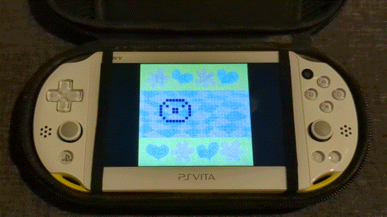
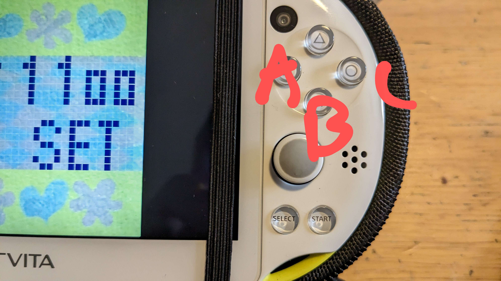

# TamaTool - A cross-platform Tamagotchi P1 explorer

# Vita fork instructions!

---

## This fork uses CMake instead of Make! Make will ONLY build the original project!

### Changes from the original project
- The Tamagotchi "shell" view doesn't exist, I hope to eventually add this back as a thing where you can use it with your vita rotated (like a phone).
- Memory and other debug functions cannot be used in the Vita version, not that there's much screen space or interactability to do so anyway.
- Your Tamagotchi ROM must be placed in `ux0:/data/tamatool` with the name `rom.bin`
    - The original project readme provides information on getting a tama ROM, so I will leave that information below. The ROM is not included in the source files or distributed binaries/archives.
- Save States will also be placed in `ux0:/data/tamatool`.

### Controls for Vita edition
- `Square - Cross - Circle` is mapped to Tama's `A - B - C` buttons
    - Or for the uninitiated, left, right, center.
- `Start` saves the state
- `Select` loads the state
    - "Pressing __Start__ saves the emulation state to a __saveN.bin__ file, while __Select__ loads the last saved state."
    - I hope to add a "save slot selector" of sorts in the near future since unlike PC, there is no easy way to "pick" a slot.
    - I am aware of some ways to add launch arguments to Vita executables, but haven't attempted such a thing.
- `R` (or `Right Bumper`) speeds up emulation in a cycle of 1x -> 10x -> unlimited
    - It is worth noting that due to the Vita's clock speeds, it may not appear to speed up. By using an OC plugin such as [PSVshell](https://github.com/Electry/PSVshell) and changing your clock to 500MHz, the results are slightly more noticeable.

### Gallery
images provided courtesy of my friend null :)




### Notes
- There is currently an elusive bug I have not been able to track down that makes the program freeze after long durations of play.
  - If this happens to you, PLEASE open an issue or contact me on Discord! @goodafternoon

### For ***BUILD INSTRUCTIONS*** please see [BUILDING.md](vita/BUILDING.md)

---

## Synopsis

TamaTool is a cross-platform Tamagotchi P1 explorer relying on the hardware agnostic Tamagotchi P1 emulation library [TamaLIB](https://github.com/jcrona/tamalib/), and mainly targeting Linux, Windows and MacOS.

More than a simple emulator, it is an exploration tool featuring a realtime RAM editor, an ASM debugger, an I/Os monitor and a sprite manipulator, allowing to play around with the Tamagotchi P1 ROM. It also allows to save and restore its emulation state, thus allowing you to backup and share your best friend !


In order to create the background image used in TamaTool, I scanned the background of my own P1, that I filtered/enhanced using GIMP. The original scan be found in the __misc__ folder. The shell is also a photo of my P1.

__Notes regarding the supported platforms__

The Windows build does not include the realtime memory editor. The ASM debugger and I/Os monitor do work, but the emulation is very slow when they are enabled because of the poor console performances.
Android support would be feasible, but a native implementation of TamaLIB without libSDL2 would probably be more efficient.

## Build instruction

First, you need to clone TamaTool and its submodule:
```
$ git clone --recursive https://github.com/jcrona/tamatool.git
```

Then the instructions depend on the targetted platform.

### Linux (or other Unix environments providing the dependencies as system libraries)

TamaTool depends on libSDL2, libSDL2-image and libpng.
On Ubuntu, you can install those libraries using the following command:
```
$ sudo apt-get install libsdl2-dev libsdl2-image-dev libpng-dev
```

Then you can build a distribution package (no library bundled) with:
```
$ make linux
```

The package will be available in the __linux__ folder.

### Windows

Only cross-compiling from linux using MinGW64 is supported. The required dependencies are provided as prebuilt binaries.
On Ubuntu you can install MinGW64 using the following command:
```
$ sudo apt install gcc-mingw-w64
```

Then you can build a distribution package (with the required libraries bundled) with:
```
$ make windows
```

The package will be available in the __windows__ folder.

### MacOS

TamaTool needs to be built on MacOS. The required dependencies are provided as prebuilt binaries.
You can build a distribution package (with the required libraries bundled) with:
```
$ make mac
```

The package will be available in the __mac__ folder.


## Usage

TamaTool being an emulator, it requires a compatible Tamagotchi P1 ROM called __rom.bin__ in its folder. This ROM is not provided here, but you can get it [there](https://www.planetemu.net/rom/mame-roms/tama) for instance.
For your information, the expected ROM format is 16 bits in big-endian per instruction (the actual E0C6S46 instructions are 12-bit long).

Hatching a new Tamagotchi:
```
$ ./tamatool
```

Starting the memory editor:
```
$ ./tamatool -e
```

Looking at the CPU instructions in realtime:
```
$ ./tamatool -c
```

Extracting the data from the ROM to a PNG file:
```
$ ./tamatool -E data.png
```

Importing back the data into the ROM:
```
$ ./tamatool -M data.png
```

When playing around with the extracted data, you can safely modify the sprites. However, modifying other data will likely result in a broken ROM.

Getting all the supported options:
```
$ ./tamatool -h
```

Once running, you can either click on the shell buttons to interact with the Tamagotchi, or you can press the __left__, __down__ and __right__ arrow keys of your keyboard.  
Pressing __s__ puts the emulation in step by step mode and executes the next instruction, while __r__ resumes it.  
Pressing __w__ fully executes the next instruction or call (no step by step inside a call).  
Pressing __x__ stops the execution right after the next call.  
Pressing __c__ stops the execution right after the next return.  
Pressing __f__ toggles between the original speed, x10 speed and unlimited speed.  
Pressing __t__ shows/hides the shell of the Tamagotchi.  
Pressing __i__ increases the size of the GUI, while __d__ decreases it.  
Pressing __b__ saves the emulation state to a __saveN.bin__ file, while __n__ loads the last saved state.


## License

TamaTool is distributed under the GPLv2 license. See the LICENSE file for more information.


## Hardware information

The Tamagotchi P1 is based on an E0C6S46 Epson MCU, and runs at 32,768 kHz. Its LCD is 32x16 B/W pixels, with 8 icons.
To my knowledge, the ROM available online has been extracted from a high-res picture of a die. The ROM mask was clear enough to be optically read. The pictures can be seen [there](https://siliconpr0n.org/map/bandai/tamagotchi-v1/) (thx asterick for the link !).  
I would love to see the same work done on a P2 and add support for it in TamaLIB/TamaTool !

__  
Copyright (C) 2021 Jean-Christophe Rona
